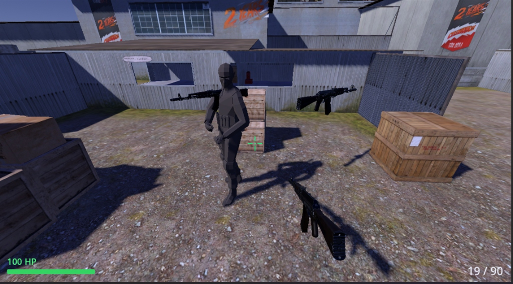
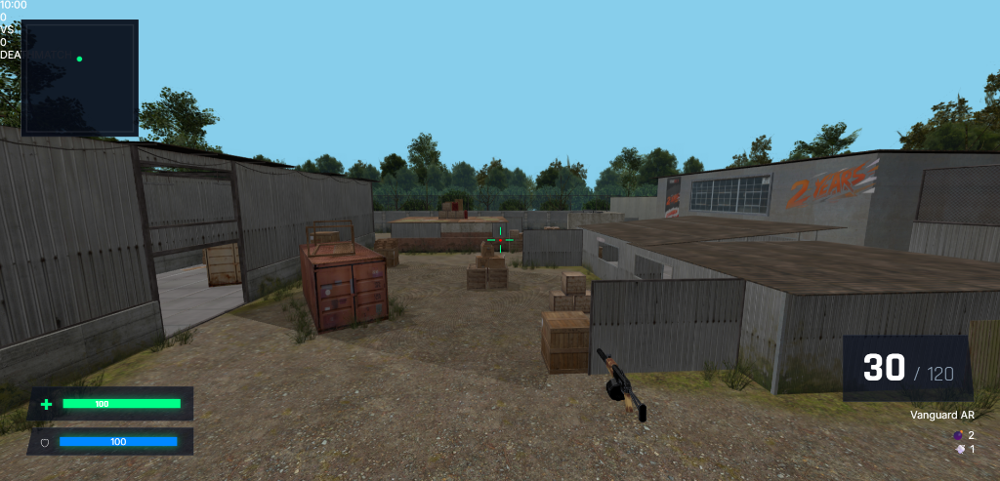
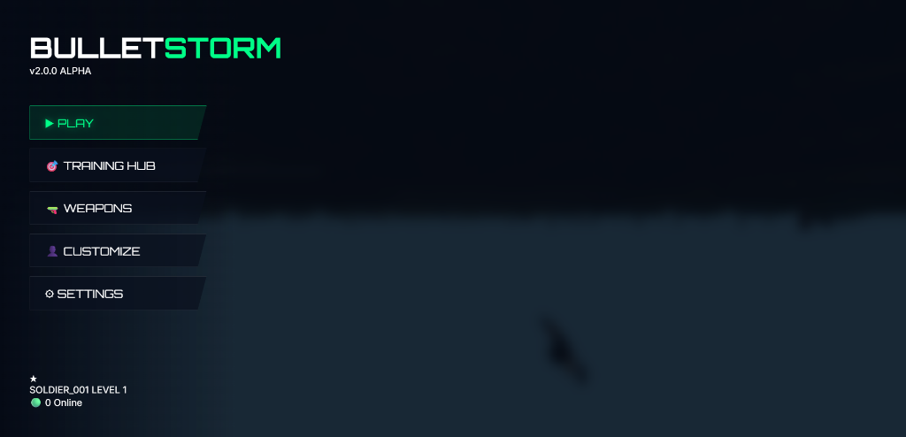
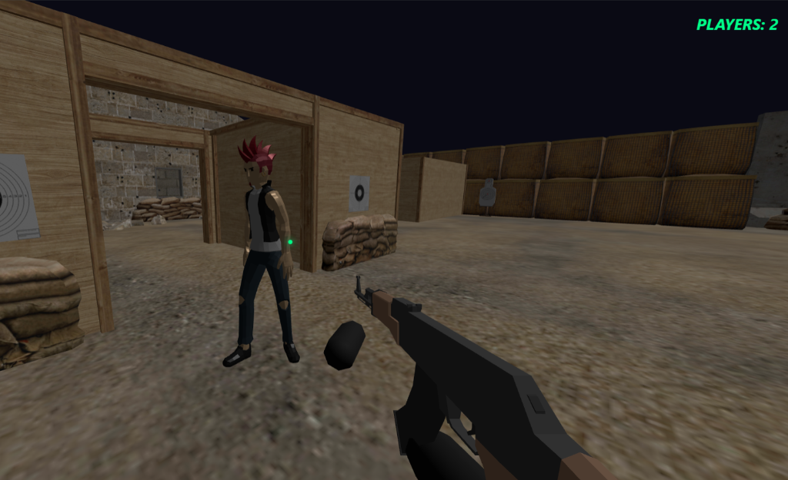
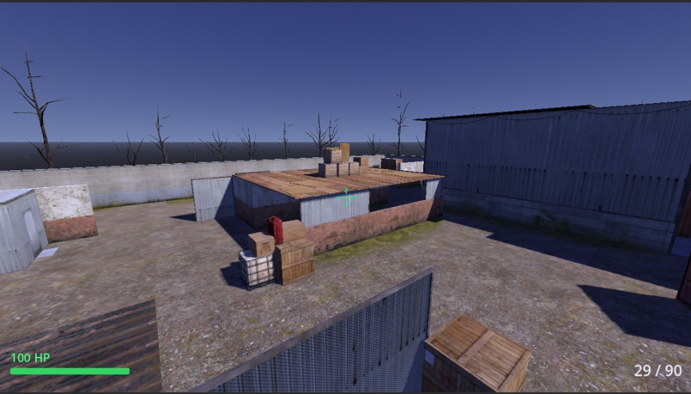

<div align="center">

# 🔫 BulletStorm Arena
**High-Performance Browser FPS Multiplayer**

[](https://threejs.org/)
[](https://nodejs.org/)
[](https://socket.io/)
[](https://opensource.org/licenses/MIT)

A fast-paced, competitive first-person shooter (FPS) designed for browser environments. It features advanced movement mechanics, skill-based gunplay, real 3D models, and a robust real-time multiplayer backend. 

</div>

---

## 🎮 Gameplay Preview

<div align="center">
  
  <br><br>
  
  
  <br><br>
  
  
</div>

---

## 🏗️ Core Architecture

### 1. Frontend (Client)
- **3D Engine:** Three.js (Optimized for 60+ FPS across devices).
- **UI Framework:** HTML5/CSS3 with Vanilla JS (Premium glassmorphic aesthetic).
- **Physics:** Cannon-es / lightweight custom AABB collision to ensure smooth, high-framerate performance on low-end devices.
- **Asset Pipeline:** 
  - Using strictly **Real 3D Models** (GLTF/GLB formats).
  - High-quality models for weapons, characters, and maps sourced from reliable CDNs.

### 2. Backend (Server)
- **Framework:** Node.js with Express.
- **Networking:** Socket.io for low-latency, real-time multiplayer synchronization.
- **Server Authority:** The server validates movement and hit detection to prevent cheating, utilizing client-side prediction for lag-free gameplay.

---

## ⚡ Performance & Optimization Strategy

To guarantee a steady **60 FPS** and cross-device compatibility:
1. **Asset Optimization:** Compressed textures, LOD (Level of Detail) models.
2. **Rendering:** Frustum culling, InstancedMeshes for repeated objects (bullets, environmental props).
3. **Tick Rate:** Server runs at a steady 20-30 ticks per second; the client interpolates positions to render smoothly at 60+ FPS.

---

## 🛣️ Development Roadmap

### Phase 1: Engine Foundation & Multiplayer Setup *(CURRENT)*
- [x] Set up Node.js server with Socket.io.
- [x] Establish the client-server connection.
- [x] Synchronize basic player positions and states across the network.

### Phase 2: High-Quality Asset Integration
- [ ] Load a real `.glb` character model.
- [ ] Load real `.glb` weapon models.
- [ ] Set up a visually stunning map (cyberpunk/neon arena style).
- [ ] Implement First-Person camera logic attached to the 3D model.

### Phase 3: Core Gameplay Mechanics
- [ ] **Advanced Movement:** Sprinting, sliding, jumping, and crouch mechanics.
- [ ] **Shooting Logic:** Raycasting from the camera center, server-validated hit detection.
- [ ] Recoil, bullet spread, and weapon firing animations.

### Phase 4: UI Integration & Game Loop
- [ ] Connect the massive HTML/CSS UI to the game engine.
- [ ] Implement Health/Damage systems, Kill Feed, and Scoreboard.
- [ ] Create game modes (Deathmatch, Team Deathmatch).

---

## 🕹️ Run The Playable Alpha

1. Build the client:
```bash
npm run build
```

2. Start the multiplayer server:
```bash
npm run server
```

3. Open your browser to:
```text
http://localhost:3000
```

### ⌨️ Controls
| Action | Key |
| :--- | :--- |
| **Move** | `W`, `A`, `S`, `D` |
| **Aim** | `Mouse` |
| **Fire** | `Left Click` |
| **ADS** | `Right Click` |
| **Reload** | `R` |
| **Sprint** | `Shift` |
| **Slide** | `C` |
| **Jump** | `Space` |
| **Weapons**| `1`, `2`, `3` |
| **Score** | `Tab` |

---

## 📜 License

This project is licensed under the **MIT License**.


---
<br>
<div align="center">
  <a href="https://github.com/kamalesh4044/multiplayer-fps-game">
    
  </a>
</div>
